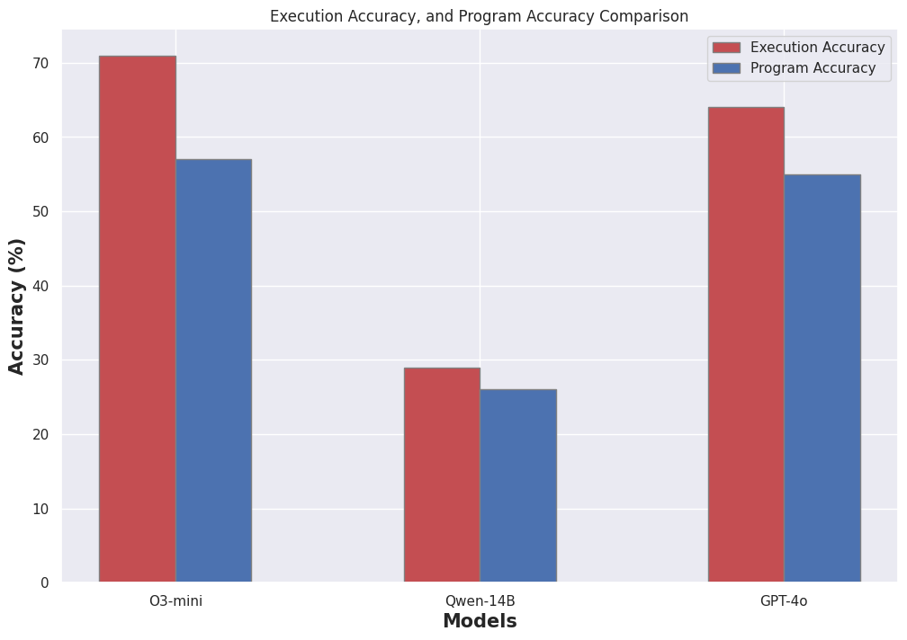
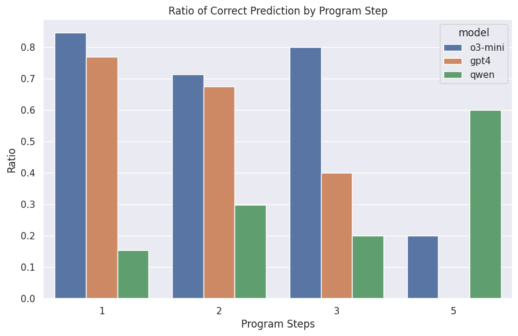

# Evaluating Programmatic Reasoning in LLMs with the ConFinQA Dataset

The **ConFinQA dataset** evaluates the performance and potential application of Language Models (LLMs) in the finance domain. The dataset contains questions that challenge models to:

- Retrieve relevant data,
- Perform numerical reasoning,
- Execute arithmetic operations to provide the correct answer.

Recent advancements in large pre-trained language models have made them excel in modeling language patterns, but they still struggle with tasks requiring **complex reasoning ability**.

This report investigates the performance of three large language models on the ConFinQA dataset:

- **GPT-4o**
- **03-mini**
- **Qwen2.5-14B**

These models have demonstrated impressive reasoning capabilities on standard benchmarks suggesting they might perform well on this task. On the MATH benchmark GPT-4o scored 75.9%, 03-mini scored 97.3% and Qwen2.5-14B scored 55.6%. Another important benchmark that test domain specific knowledge is the Open Financial LLM Leaderboard where GPT4-turbo have an Average Performance of 39.2% and Qwen2.5-7B 28.2%. GPT-4o and 03-mini models are currently not benchmarked on this leaderboard but they are successor to GPT4-turbo and are expected to have equivalent or better performance. Likewise Qwen2.5-14B is not benchmarked but a better performance is assumed.


## 📊 Dataset Structure
The data contains 3037 questions based on a financial report. Each question has 3 labeled answers

- A formatted answer
- A symbolic program
- The execution result of the program

Each question is grounded in a **financial report** with the following structure:

- `pre_text`
- `table`
- `post_text`

This serves as the **context** for answering the question.


## 🧠 Model Approach
A **zero-shot prompt** is issued to each model. This prompt:

1. Describes the **role** of the model.
2. Specifies the **task** to be performed.
3. Defines the **expected output**.

This task is focused on **numerical reasoning** — understanding a clear question, applying domain-specific knowledge, and performing high school-level mathematical operations.

### Why Zero-Shot?

- LLMs are trained on a **large corpus**, including financial texts.
- Few-shot prompts can **limit** model reasoning and induce copying behavior ([Zhiyu Chen et al]).
- Carefully selecting examples is impractical due to the **infinite question space**.

The prompt describes:

- Allowed operations
- Referencing mechanisms for intermediate steps
- Relevant constants
- Two output examples

<details>
<summary>📜 **System Prompt** (Click to expand)</summary>

```text
<|begin_of_text|><|start_header_id|>system<|end_header_id|>

You are a helpful Financial Analyst with strong quantitative analysis skill and keen eyes for details.
You provide accurate answers to users questions based on a financial report.

You would be provided with a financial report containing tables and textual information.
The report would serve as the context required to give accurate answers to users' queries.

The user would ask you a question based on the report.
Your ultimate goal is to breakdown complex numerical reasoning into simple programmatic steps.
You are to generate a list of action steps
Your response could be a single value from the report i.e `482` or muliple sequential and dependent steps `subtract(400, 210), divide(#0, const_100)`

An operation takes two values as arguments. These arguments are retrieved from the provided context (Financial Report Text and Table).


Reference Operations
- add: addition
- subtract: subtraction
- multiply: multiplication
- divide: division
- exp: power
- greater: maximum

You are Limited to these operations.

Reference Tags
#0 references the first operation
#1 references the second operation
#2 references the third operation
...

#n references the nth operation

Constants
- const_1,
- const_2,
- const_3,
- const_4,
- const_5,
- const_6,
- const_7,
- const_8,
- const_9,
- const_10,
- const_100,
- const_1000,
- const_10000,
- const_100000,
- const_1000000,
...

- const_1000000000
- const_m1

Constants are important when an operation needs to be formatted eg currency conversion, percentage, ratio, proportion etc.
The choice of constant is decided by the user query. Constants are always between 1 - 10 or multiple of 10 except constant_m1.
Note: const_m1 (-1) is for negative

Enclose information relevant to the user's question from the context using this tag
<relevant_context>
....
</relevant_context>

Enclose the list of operations to calculate the answer using this tag
<operation>
subtract(200, 100), divide(#0, const_100), subtract(1250, const_10)
</operation>

An operation could also be a single value.

<operation> 10 </operation>

Specify the format of the final answer using e.g (%) <format>%</format>


<|eot_id|>
```
</details>


Instead of directly returning the answer, models are asked to return a **sequential program**. This helps:

- Evaluate **programmatic reasoning**
- Avoid arithmetic errors
- Diagnose **domain knowledge** limitations

The context is provided as an **HTML document** for better parsing by LLMs.

## 📈 Results and Discussion

The models were evaluated on the **first 100 questions** from ConFinQA `train.json`.

- **Execution accuracy**: Compares model’s final answer (`exe_ans`) with ground truth.
- **Program accuracy**: Compares generated symbolic program with ground truth program.

Special handling was required for **percentage values**, as they might be returned as ratios or actual percentages.


### 📊 Result Bar Plot




As seen in the chart, 03-mini is the best performing model, achieving 71% in execution accuracy and 57% in program accuracy, followed by GPT-4o at 64% execution accuracy, and 55% program accuracy and lastly Qwen2.5-14B scored 29% in execution accuracy and 26% in program accuracy. Since the result of the models is a derivative of the program, it begs the question why the program accuracy differs  from the execution accuracy. This is because the model used another approach different to the ground truth program.

### 🔁 Alternative Programs, Same Answer

<details>
<summary>📄 Baker Hughes Financial Statement Summary (Click to Expand)</summary>

baker hughes , a ge company notes to consolidated and combined financial statements bhge 2017 form 10-k | 85 the total intrinsic value of rsus ( defined as the value of the shares awarded at the current market price ) vested and outstanding in 2017 was $ 17 million and $ 38 million , respectively . the total fair value of rsus vested in 2017 was $ 19 million . as of december 31 , 2017 , there was $ 98 million of total unrecognized compensation cost related to unvested rsus , which is expected to be recognized over a weighted average period of 2.5 years . note 12 . equity common stock we are authorized to issue 2 billion shares of class a common stock , 1.25 billion shares of class b common stock and 50 million shares of preferred stock each of which have a par value of $ 0.0001 per share . on july 3 , 2017 , each share of baker hughes common stock was converted into one share of class a common stock in the company . the number of class a common stock and class b common stock shares outstanding at december 31 , 2017 is 422 million and 707 million , respectively . we have not issued any preferred stock . ge owns all the issued and outstanding class b common stock . each share of class a and class b common stock and the associated membership interest in bhge llc form a paired interest . while each share of class b common stock has equal voting rights to a share of class a common stock , it has no economic rights , meaning holders of class b common stock have no right to dividends and any assets in the event of liquidation of the company . former baker hughes stockholders immediately after the completion of the transactions received a special one-time cash dividend of $ 17.50 per share paid by the company to holders of record of the company's class a common stock . in addition , during 2017 the company declared and paid regular dividends of $ 0.17 per share and $ 0.18 per share to holders of record of the company's class a common stock during the quarters ended september 30 , 2017 and december 31 , 2017 , respectively . the following table presents the changes in number of shares outstanding ( in thousands ) : class a common class b common .

<pre>
1                                        class a common stock   class b common stock
2  balance at december 31, 2016            2014                 2014
3  issue of shares on business combination  427709              717111
4  issue of shares upon vesting of RSUs (1) 290                 2014
5  issue of shares on exercises of options (1) 256             2014
6  stock repurchase program (2)(3)         -6047 (6047)        -10126 (10126)
7  balance at december 31, 2017             422208              706985

(1) Share amounts are net of shares withheld for employee tax obligations.
(2) On Nov 2, 2017, BHGE LLC authorized repurchase of up to $3 billion in common units.
(3) In 2017, we repurchased:
    - 6,046,735 Class A shares ($187M)
    - 10,126,467 Class B shares from GE ($314M)
  </pre>

( 1 ) share amounts reflected above are net of shares withheld to satisfy the employee's tax withholding obligation . ( 2 ) on november 2 , 2017 , our board of directors authorized bhge llc to repurchase up to $ 3 billion of its common units from the company and ge . the proceeds of this repurchase are to be used by bhge to repurchase class a common stock of the company on the open market , which if fully implemented would result in the repurchase of approximately $ 1.1 billion of class a common stock . the class b common stock of the company , that is paired with repurchased common units , was repurchased by the company at par value . the $ 3 billion repurchase authorization is the aggregate authorization for repurchases of class a and class b common stock together with its paired unit . bhge llc had authorization remaining to repurchase up to approximately $ 2.5 billion of its common units from bhge and ge at december 31 , 2017 . ( 3 ) during 2017 , we repurchased and canceled 6046735 shares of class a common stock for a total of $ 187 million . we also repurchased and canceled 10126467 shares of class b common stock from ge which is paired together with common units of bhge llc for $ 314 million. .
</details>

For example:

- Ground truth computes portion of Class B shares **in millions** `multiply(1.25, const_1000), divide(707, #0)`
- 03-mini computes the same portion **as a percentage in thousands** `divide(706985, 1250000), multiply(#0, const_100)`

Both approaches achieved the same computation but structure their operations differently.

## 🔍 Insight on Qwen2.5-14B



Interestingly, Qwen2.5-14B:

- Struggled with **single-step** questions — indicating **limited domain knowledge**
- Outperformed others on **multi-step (5 operations)** questions — solving 3 out of 5

> Only 5 of the 100 questions had 5-step programs

Further investigation shows these questions could be answered in fewer steps as demonstrated by the model. Qwen poor performance on single step questions exposes its limited domain knowledge to retrieve the correct data to answer these questions.